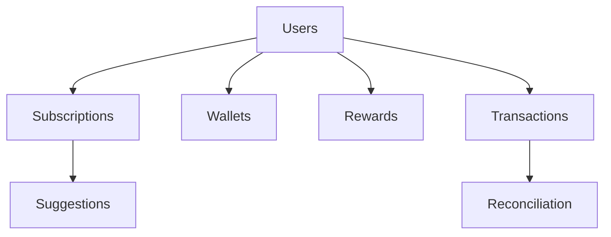

<p align="center">
  
</p>

# 🚀 PayPilot

<div align="center">


</div>

> **Smart Payment Control & Reconciliation Platform** — Manage subscriptions, track rewards, reconcile bank statements, and control multiple wallets from one intelligent dashboard.

<br/>

## 📸 Preview

| Dashboard | Subscriptions | Transactions | Rewards |
|:---:|:---:|:---:|:---:|
| KPI Cards + Charts | Gmail Integration | Real CSV Data | Redeemable Points |

---

## 🌐 Live Demo

| Service | URL |
|---------|-----|
| **Frontend** | [https://paypilot-woad.vercel.app](https://paypilot-woad.vercel.app) |

---

## 🎯 Problem Statement

Users face **8 critical payment problems** that no single platform solves:

| # | Problem | Solution |
|---|---------|----------|
| 1 | Missing Subscription Pause Logic | Built-in tracking and step-by-step guides for pausing auto-debits. |
| 2 | Difficult Reward Redemption | Unified dashboard for tracking and redeeming points easily. |
| 3 | Confusing Cashback Terms | Transparent tracking of rewards, cashback, and miles. |
| 4 | Opaque Maintenance Billing | Itemized breakdowns for recurring service payments. |
| 5 | Tedious Bank Reconciliation | Automated CSV parsing with high-accuracy pattern detection. |
| 6 | Low Reward Visibility | Unified view across UPI and multiple wallet ecosystems. |
| 7 | Complex Foreign Pricing | Simplified tracking of international transaction costs. |
| 8 | Fragmented Wallet Management | Single dashboard to control and compare multiple payment app wallets. |

---

## ✨ Key Features

### 🔐 Authentication & Security
- **JWT-based Authentication**: Secure token management with 30-day expiry.
- **Bcrypt Hashing**: Industry-standard password protection.
- **Protected Routes**: Middleware-secured API endpoints.
- **Security Headers**: Hardened with Helmet and rate-limiting protection.

### 📧 Gmail Integration
- **OAuth 2.0 Flow**: Secure, verified connection to your Gmail account.
- **Auto-Scanning**: Intelligent receipt detection for subscription tracking.
- **One-Click Sync**: Easily connect or disconnect your account at any time.

### 📊 CSV Bank Statement Processing
- **Drag-and-Drop**: Seamless upload for bank statements in CSV format.
- **Pattern Detection**: Advanced algorithm with **70-95% confidence scoring**.
- **Auto-Categorization**: Intelligently identifies merchants and categories.
- **Subscription Suggestions**: Automated recurring payment detection for approval.

### 💳 Subscription Management
- **Centralized Dashboard**: Track every recurring payment in one place.
- **Pause/Resume Tracking**: Instant status updates for your subscriptions.
- **Cancellation Guides**: Step-by-step instructions for Netflix, Spotify, Amazon Prime, and more.

### 📈 Dashboard Analytics
- **Real-Time KPIs**: Track Total Spend, Active Subscriptions, Rewards, and Savings.
- **Dynamic Charts**: Monthly spending trends and category breakdown visualizations.
- **Action Alerts**: Notifications for pending reconciliations and renewals.

### 🔄 Transaction Management
- **Real-World Data**: Processed from your actual bank statements (no mock data).
- **Advanced Filters**: Search by status, category, or merchant.
- **Export Support**: One-click CSV export for your filtered transaction data.

### 🏆 Rewards Tracking
- **Unified Tracker**: Monitor points, cashback, and miles from all sources.
- **Bulk Redemption**: Unified "Redeem Rewards" interface.
- **Performance History**: Interactive charts with 6-month and 1-year toggles.

### 👛 Multi-Wallet Management
- **Glassmorphism UI**: Beautifully designed wallet cards with grid/list toggles.
- **Compare View**: Side-by-side table for liquidity comparison across wallets.
- **Total Liquidity**: Real-time aggregation of all your digital assets.

### ⚙️ Settings & Customization
- **Profile Management**: Update your personal information and preferences.
- **Notification Control**: Granular settings for Email, Push, and Reminders.
- **API Key Management**: Securely manage, regenerate, and toggle API key visibility.
- **Security Center**: 2FA toggle, active session management, and password reset.

---

## 🛠️ Tech Stack

### Frontend
- **Core**: React 18, Vite
- **Styling**: Tailwind CSS, Framer Motion
- **Icons**: Lucide Icons
- **Navigation**: React Router DOM v6

### Backend
- **Runtime**: Node.js
- **Framework**: Express 5
- **Database**: MongoDB Atlas (Mongoose ODM)
- **Security**: JWT, bcrypt, Helmet, Express Rate Limit
- **Services**: Gmail API, Plaid (Sandbox), CSV Parser, Multer

---

## 📊 Database Schema (7 Collections)



---

## 🔗 API Endpoints (30+ Endpoints)

| Module | Endpoints |
|--------|-----------|
| **Auth** | `POST /api/auth/register`, `POST /api/auth/login` |
| **Users** | `GET/PUT /api/users/profile`, `GET/PUT /api/users/settings`, `GET /api/users/gmail-status` |
| **Subscriptions** | `GET/POST /api/subscriptions`, `PATCH /api/subscriptions/:id/pause`, `PATCH /api/subscriptions/:id/resume` |
| **Suggestions** | `GET /api/subscriptions/suggestions`, `POST /api/subscriptions/suggestions/:id/approve` |
| **Transactions** | `GET /api/transactions`, `PUT /api/transactions/:id` |
| **Dashboard** | `GET /api/dashboard/stats`, `GET /api/dashboard/charts` |
| **Rewards** | `GET/POST /api/rewards`, `GET /api/rewards/summary/sources` |
| **Wallets** | `GET/POST /api/wallets`, `GET/PUT/DELETE /api/wallets/:id` |
| **Gmail** | `GET /api/gmail/auth-url`, `GET /api/gmail/callback`, `POST /api/gmail/scan` |
| **Plaid** | `POST /api/plaid/create-link-token`, `POST /api/plaid/exchange-public-token` |

---

## 📁 Project Structure

```text
PayPilot/
├── backend/
│   ├── src/
│   │   ├── controllers/    # Business logic (10 controllers)
│   │   ├── routes/         # API routes (12 route files)
│   │   ├── models/         # Mongoose schemas (7 models)
│   │   ├── middleware/     # Auth & validation
│   │   └── services/       # Gmail, Plaid, Pattern Detector
│   └── index.js            # Server entry point
├── frontend/
│   ├── src/
│   │   ├── pages/         # 12 page components
│   │   ├── components/    # Reusable UI components
│   │   └── main.jsx       # Entry point
│   └── vite.config.js
└── README.md
```

---

## 🚀 Quick Start

### Prerequisites
- Node.js 18+
- MongoDB Atlas account
- Google Cloud Console project (for Gmail API)

### Installation

```bash
# Clone repository
git clone https://github.com/anand880441-source/PayPilot.git
cd PayPilot

# Backend setup
cd backend
npm install
# Create .env file (see variables below)
npm run dev

# Frontend setup
cd ../frontend
npm install
npm run dev
```

### 🔧 Environment Variables

**Backend (`.env`)**
```env
PORT=5000
DATABASE_URL=mongodb+srv://...
JWT_SECRET=your_secret_key
GMAIL_CLIENT_ID=...
GMAIL_CLIENT_SECRET=...
```

---

## 🔮 Future Scope
- [ ] **AI Spending Insights**: Predictive analytics for your financial health.
- [ ] **PDF OCR Parsing**: Upload statements in PDF format for automatic extraction.
- [ ] **Mobile Experience**: Native mobile app built with React Native.
- [ ] **Multi-Currency Support**: Unified tracking for international accounts.

---

## 👨‍💻 Developer
**Anand Suthar**  
*Full Stack MERN Developer*

[](https://github.com/anand880441-source)

---

<p align="center"> <b>PayPilot — Smart Payment Control, Simplified.</b> 🚀 </p>
