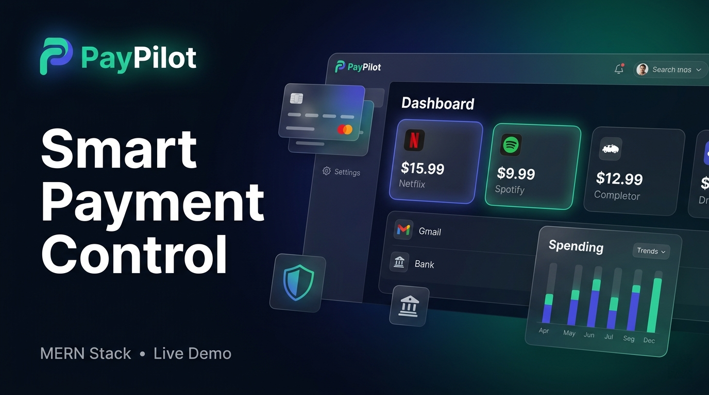
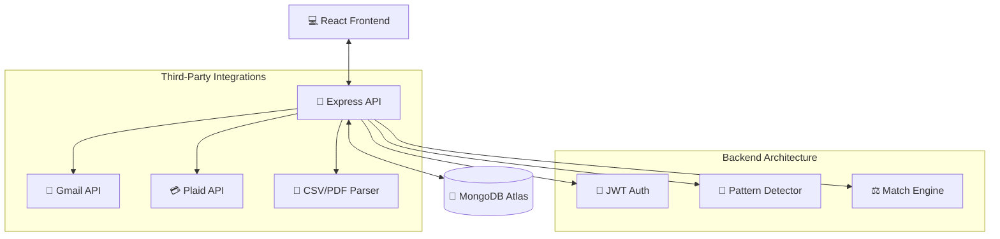

<div align="center">

<p align="center">
  
</p>

# 🚀 PayPilot
### **Smart Payment Control & Reconciliation Platform**

Manage subscriptions, track rewards, reconcile bank statements, and control multiple wallets from one intelligent dashboard.

[](https://www.mongodb.com/mern-stack)
[](https://reactjs.org/)
[](https://nodejs.org/)
[](https://expressjs.com/)
[](https://www.mongodb.com/cloud/atlas)
[](https://tailwindcss.com/)
[](https://vercel.com/)
[](https://render.com/)
[](#)
[](LICENSE)

[Live Demo](https://paypilot-woad.vercel.app) • [API Docs](https://documenter.getpostman.com/view/50840839/2sBXqKofPN) • [Design File](https://www.figma.com/design/hrkpbXgWoFl6iuThOkYgso/Untitled?node-id=0-1&t=HKkoUgRnmv9E5usv-1) • [Report Bug](https://github.com/anand880441-source/PayPilot/issues)

</div>

---

## 🏗️ System Architecture



---

## 📑 Table of Contents
- [📸 Preview](#-preview)
- [🏗️ Architecture](#️-system-architecture)
- [🌐 Live Links](#-live-demo--important-links)
- [🎯 Problem Statement](#-problem-statement)
- [✨ Key Features](#-key-features)
- [🛠️ Tech Stack](#-tech-stack)
- [📊 Database Schema](#-database-schema-7-collections)
- [🔗 API Endpoints](#-api-endpoints-45-endpoints)
- [📁 Project Structure](#-project-structure)
- [🚀 Quick Start](#-quick-start)
- [🔧 Environment Variables](#-environment-variables)
- [🔮 Future Scope](#-future-scope)
- [👨‍💻 Developer](#-developer)

---

## 📸 Preview

| **Dashboard** | **Subscriptions** | **Transactions** | **Rewards** |
|:---:|:---:|:---:|:---:|
|  |  |  |  |
| *KPI Cards + Charts* | *Gmail Integration* | *Real CSV Data* | *Redeemable Points* |

---

## 🌐 Live Demo & Important Links

| Service | Destination |
|:--- |:--- |
| 🚀 **Frontend Deployment** | [paypilot-woad.vercel.app](https://paypilot-woad.vercel.app) |
| ⚙️ **Backend API** | [paypilot-api.onrender.com](https://paypilot-api.onrender.com) |
| 📦 **GitHub Repo** | [anand880441-source/PayPilot](https://github.com/anand880441-source/PayPilot) |
| 📖 **Postman Docs** | [View Documentation](https://documenter.getpostman.com/view/50840839/2sBXqKofPN) |
| 🎨 **Figma Design** | [View Design File](https://www.figma.com/design/hrkpbXgWoFl6iuThOkYgso/Untitled?node-id=0-1&t=HKkoUgRnmv9E5usv-1) |
| 🕹️ **Figma Prototype** | [Interactive Prototype](https://www.figma.com/proto/hrkpbXgWoFl6iuThOkYgso/Untitled?page-id=0%3A1&node-id=10-14&viewport=324%2C616%2C0.21&t=o3mqsTrgA0Ygo8Nk-1&scaling=contain&content-scaling=responsive) |

---

## 🎯 Problem Statement

Users face **8 critical payment hurdles** that PayPilot solves elegantly:

| # | The Pain Point | The PayPilot Solution |
|:---:|:--- |:--- |
| 1 | **Missing Pause Logic** | Built-in tracking and step-by-step guides for pausing auto-debits. |
| 2 | **Difficult Redemptions** | Unified dashboard for tracking and redeeming points easily. |
| 3 | **Confusing Cashback** | Transparent tracking of rewards, cashback, and miles. |
| 4 | **Opaque Billing** | Itemized breakdowns for recurring service payments. |
| 5 | **Tedious Reconciliation** | Automated CSV parsing with high-accuracy pattern detection. |
| 6 | **Low Reward Visibility** | Unified view across UPI and multiple wallet ecosystems. |
| 7 | **Complex Pricing** | Simplified tracking of international transaction costs. |
| 8 | **Fragmented Wallets** | Single dashboard to control and compare multiple wallets. |

---

## ✨ Key Features

### 🔐 Security & Auth
*   **Secure Access**: JWT-based Authentication with 30-day token persistence.
*   **Data Integrity**: Bcrypt password hashing & Helmet security headers.
*   **Rate Limiting**: Protection against brute-force attacks.

### 📧 Intelligent Integration
*   **Gmail Sync**: OAuth 2.0 flow to scan receipts automatically.
*   **Receipt Detection**: AI-powered identification of subscription emails.
*   **Privacy First**: One-click connect/disconnect for user data control.

### 📊 Bank Statement Processing
*   **Smart Parsing**: Drag-and-drop CSV bank statement uploader.
*   **Pattern Recognition**: Proprietary algorithm with **70-95% confidence scoring**.
*   **Auto-Categorization**: Intelligent merchant & category mapping.

### 💳 Subscription Management
*   **Control Center**: Pause, resume, and track all recurring payments.
*   **Exit Strategies**: Curated cancellation guides for major services (Netflix, Amazon, etc.).
*   **Approval Workflow**: Verify suggested subscriptions before they go live.

### 📈 Advanced Analytics
*   **Visual Spending**: Dynamic charts for monthly trends and category breakdowns.
*   **KPI Tracking**: Real-time stats on Total Spend, Savings, and active Rewards.
*   **Actionable Alerts**: Notifications for renewals and reconciliation tasks.

---

## 🛠️ Tech Stack

<table align="center">
  <tr>
    <td align="center" width="96">
      
      <br/>React
    </td>
    <td align="center" width="96">
      
      <br/>Node.js
    </td>
    <td align="center" width="96">
      
      <br/>Express
    </td>
    <td align="center" width="96">
      
      <br/>MongoDB
    </td>
    <td align="center" width="96">
      
      <br/>Tailwind
    </td>
    <td align="center" width="96">
      
      <br/>Vite
    </td>
    <td align="center" width="96">
      
      <br/>Vercel
    </td>
  </tr>
</table>


---

## 🔗 API Endpoints (45 Endpoints)
> Full documentation available on [Postman](https://documenter.getpostman.com/view/your-workspace/paypilot-api).

| Module | Core Endpoints |
|:--- |:--- |
| 🔑 **Auth** | `POST /register`, `POST /login` |
| 👤 **Users** | `GET /profile`, `PUT /settings`, `GET /gmail-status` |
| 💳 **Subs** | `GET /subscriptions`, `PATCH /subscriptions/:id/pause` |
| 📑 **Bank** | `GET /suggestions`, `POST /suggestions/:id/approve` |
| 💸 **Trans** | `GET /transactions`, `PUT /transactions/:id` |
| 📊 **Dash** | `GET /dashboard/stats`, `GET /dashboard/charts` |
| 🏆 **Rewards** | `GET /rewards`, `GET /rewards/summary` |
| 👛 **Wallets** | `GET /wallets`, `PUT /wallets/:id` |
| 📧 **Gmail** | `GET /gmail/auth-url`, `POST /gmail/scan` |

---

## 📁 Project Structure

```text
PayPilot/
├── 📁 backend/
│   ├── 📁 src/
│   │   ├── 📂 controllers/    # Business logic (10 controllers)
│   │   ├── 📂 routes/         # API routes (12 route files)
│   │   ├── 📂 models/         # Mongoose schemas (7 models)
│   │   └── 📂 services/       # Gmail, Plaid, Pattern Detector
│   └── 📄 index.js            # Entry point
└── 📁 frontend/
    ├── 📁 src/
    │   ├── 📂 pages/          # 12 page components
    │   └── 📂 components/     # Reusable UI elements
    └── 📄 vite.config.js      # Build config
```

---

## 🚀 Quick Start

### 1️⃣ Prerequisites
*   Node.js **v18+**
*   **MongoDB Atlas** account
*   **Google Cloud Console** project (Gmail API enabled)

### 2️⃣ Installation & Setup
```bash
# Clone the repository
git clone https://github.com/anand880441-source/PayPilot.git
cd PayPilot

# Setup Backend
cd backend
npm install
# Configure your .env file
npm run dev

# Setup Frontend
cd ../frontend
npm install
npm run dev
```

---

## 🔧 Environment Variables

Create a `.env` file in the `backend/` directory:

```env
PORT=5000
DATABASE_URL=mongodb+srv://<user>:<password>@cluster0.mongodb.net/paypilot
JWT_SECRET=your_jwt_super_secret_key
GMAIL_CLIENT_ID=your_google_client_id
GMAIL_CLIENT_SECRET=your_google_client_secret
```

---

## 🔮 Future Scope

*   🤖 **AI Spending Insights**: Predictive analytics for your financial health.
*   📄 **PDF OCR Parsing**: Upload statements in PDF format for automatic extraction.
*   📱 **Mobile Experience**: Native mobile app built with React Native.
*   🌍 **Multi-Currency**: Unified tracking for international accounts.

---

## 👨‍💻 Developer

<div align="center">

**Anand Suthar**
*Full Stack MERN Developer*

[](https://github.com/anand880441-source)

<br/>

**PayPilot — Smart Payment Control, Simplified.** 🚀

</div>
