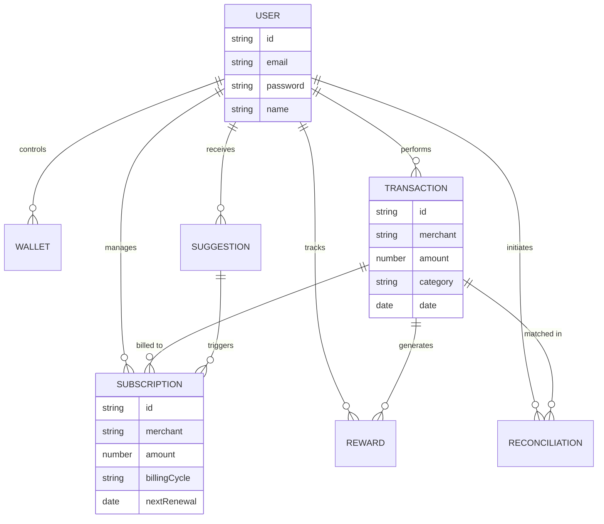

<div align="center">

# 🚀 PayPilot - Backend API
### **The Engine Behind Smart Payment Control**

This is the core server for PayPilot, handling authentication, data processing, external integrations (Gmail, Plaid), and financial analytics.

[](https://nodejs.org/)
[](https://expressjs.com/)
[](https://www.mongodb.com/cloud/atlas)
[](https://jwt.io/)

</div>

---

## 🛠️ Tech Stack

- **Runtime**: Node.js v22+
- **Framework**: Express.js
- **Database**: MongoDB Atlas (Mongoose ODM)
- **Security**: JWT, Bcrypt, Helmet, Express Rate Limit
- **File Handling**: Multer (for CSV uploads)
- **Services**: 
  - **Gmail API**: For automated subscription scanning.
  - **Plaid API**: For secure bank connection (Sandbox mode).
  - **Pattern Engine**: Custom algorithm for transaction matching.

---

## 📊 Database Schema (7 Collections)



---

## 🔗 API Documentation

Full documentation is available on [Postman](https://documenter.getpostman.com/view/50840839/2sBXqKofPN).

### Core Endpoints

| Category | Endpoint | Method | Description |
|:--- |:--- |:--- |:--- |
| **Auth** | `/api/auth/register` | `POST` | Create a new account |
| | `/api/auth/login` | `POST` | Authenticate and get JWT |
| **Subscriptions** | `/api/subscriptions` | `GET` | Fetch all active subscriptions |
| | `/api/subscriptions/:id/pause` | `PATCH` | Mark a sub as paused |
| **Transactions** | `/api/transactions` | `GET` | List reconciled transactions |
| **Gmail** | `/api/gmail/auth-url` | `GET` | Get Google OAuth URL |
| | `/api/gmail/scan` | `POST` | Scan inbox for receipts |
| **Wallets** | `/api/wallets` | `GET` | List all linked wallets |

---

## 📁 Project Structure

```text
backend/
├── 📁 src/
│   ├── 📂 controllers/    # Route handlers & Business logic
│   ├── 📂 routes/         # Express route definitions
│   ├── 📂 models/         # Mongoose Schemas (User, Trans, etc.)
│   ├── 📂 middleware/     # Auth (JWT) & Validation
│   └── 📂 services/       # Gmail API, Pattern Matching, Plaid
├── 📄 index.js            # Server Entry Point
└── 📄 package.json        # Dependencies
```

---

## 🚀 Getting Started

### Prerequisites
- Node.js 18+
- MongoDB Atlas URI
- Google Cloud credentials (for Gmail API)

### Installation
1. Navigate to the backend directory:
   ```bash
   cd backend
   ```
2. Install dependencies:
   ```bash
   npm install
   ```
3. Create a `.env` file:
   ```env
   PORT=5000
   DATABASE_URL=your_mongodb_uri
   JWT_SECRET=your_secret_key
   GMAIL_CLIENT_ID=...
   GMAIL_CLIENT_SECRET=...
   GMAIL_REDIRECT_URI=...
   ```
4. Run the server:
   ```bash
   npm run dev
   ```

---

## 👨‍💻 Developer
**Anand Suthar**
*MERN Stack Developer*
